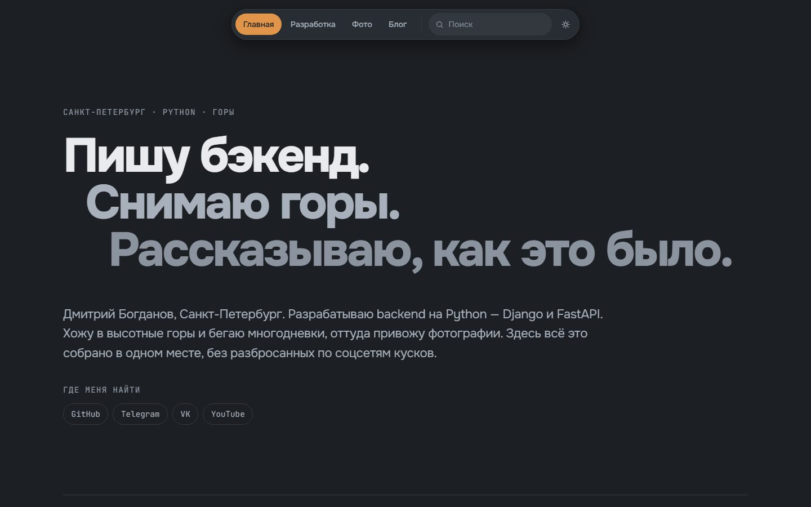
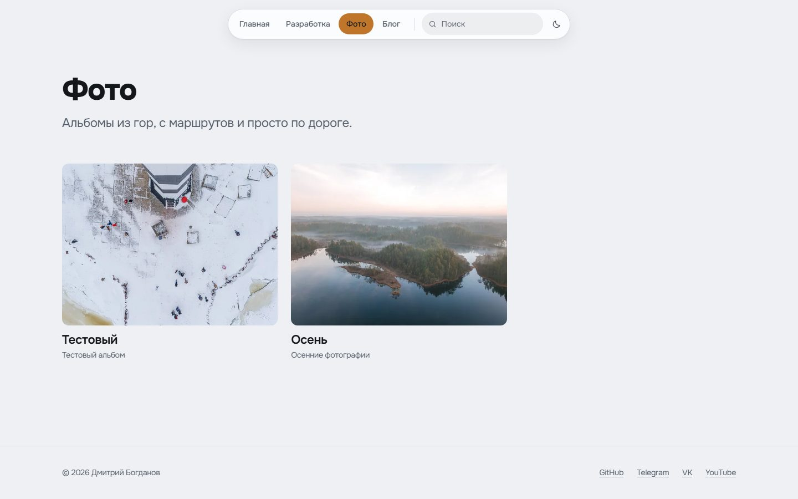
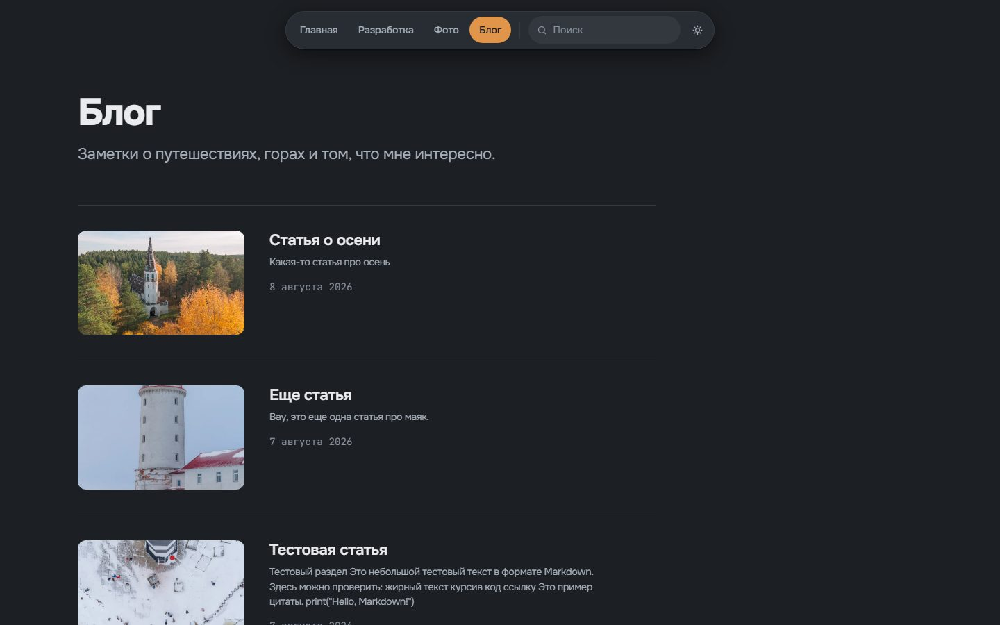
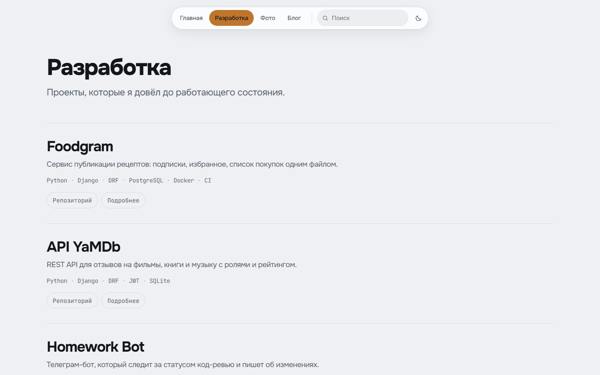

# Портфолио — разработка, фотография, блог

Личный сайт Дмитрия Богданова: четыре раздела, редактируемые прямо со страницы,
без админки как отдельного приложения. Вошёл под своим логином — и правишь текст
там, где он живёт.

FastAPI + Jinja2 + htmx + PostgreSQL. Ни одного внешнего запроса со страницы:
шрифты, стили и скрипты свои, Content-Security-Policy строгая.

<p align="center">
  
  
</p>
<p align="center">
  
  
</p>

## Что умеет

**Фото.** Альбомы с контактным листом: каждый кадр в своей пропорции, не обрезан
под общую сетку. Пакетная загрузка перетаскиванием, обработка в фоне, лайтбокс
с клавиатуры. Оригиналы хранятся, но недостижимы по URL — наружу смотрит только
каталог с производными.

**Блог.** Markdown с живым предпросмотром, который идёт через тот же рендерер,
что и публикация, так что разойтись они не могут. Картинки вставляются
перетаскиванием или из буфера, ширина задаётся словом в самом Markdown —
`{.wide}`, — подпись берётся из заголовка картинки.

**Разработка.** Карточки проектов со стеком, ссылками на репозиторий и демо,
порядком и необязательной подробной страницей.

**Общее.** Полнотекстовый поиск с русской морфологией (`эльбрусе` находит
«Эльбрус»), светлая и тёмная темы, `sitemap.xml`, Open Graph, работа
с клавиатуры целиком и контраст по WCAG 2.2 AA в обеих темах.

## Стек

| | |
|---|---|
| Python | 3.13 |
| Веб | FastAPI · Jinja2 · htmx 2.0 |
| База | PostgreSQL 18, полнотекстовый поиск `russian` |
| ORM / миграции | SQLAlchemy 2 · Alembic |
| Картинки | Pillow — WebP-производные, `srcset` |
| Markdown | markdown-it-py + nh3 (санитайзер по белому списку) |
| Пароли | Argon2id |
| Фронтенд | рукописный CSS, без сборки и без Node |
| Тесты | pytest · Playwright |
| Прод | Docker Compose + Caddy с автоматическим HTTPS |

## Быстрый старт

Нужен Docker. Больше ничего.

```bash
cp .env.example .env
# Обязательно поменяйте SECRET_KEY и ADMIN_PASSWORD — приложение
# не запустится с оставленными плейсхолдерами.
python -c "import secrets; print(secrets.token_urlsafe(48))"

make up
```

Сайт на http://localhost:8000, вход в `/login`.

```
make up        # собрать и поднять
make down      # остановить (фотографии в ./data не трогаются)
make logs      # смотреть логи
make migrate   # применить миграции
make psql      # psql к базе
make lint      # ruff check + format --check
make test      # тесты
```

## Тесты

```bash
make test                 # unit + API, внутри контейнера
uv run pytest e2e         # Playwright, с хоста, при поднятом make up
uv run pytest e2e -m launch_flow   # шесть ключевых сценариев
```

Две вещи, о которые тут легко споткнуться:

- **Тесты запускаются в контейнере.** На Windows-хосте `pytest` виснет
  до сбора тестов — клиент Starlette не возвращает управление. В контейнере
  среда та же, что на сервере.
- **`-q` задан дважды, поэтому успешный прогон печатает точки без итоговой
  строки. Смотрите код возврата.** И никогда не пропускайте прогон через
  `tail` или `grep`: вы получите код возврата пайпа, и красный прогон
  прочитается как зелёный.

## Резервные копии

```bash
make backup         # дамп базы + архив медиа в ./data/backups
make restore-check  # репетиция восстановления в отдельную базу
```

`restore-check` не просто проигрывает дамп: он сверяет каждый восстановленный
путь с архивом медиа. Дамп может лечь идеально и всё равно оставить сломанный
сайт, если два артефакта сделаны в разные моменты — это и ловится.

## Обслуживание медиа

Удаление статьи, проекта, альбома или снимка удаляет и файлы, которые с ними
пришли; сохранение статьи убирает картинки, вынутые из текста. Ничего, на что
ссылается другая страница, при этом не пропадает: проверка читает те же строки,
из которых собираются сами страницы. Один и тот же кадр, загруженный дважды,
хранится один раз — картинка, которую используют две статьи, это один файл
на диске.

Два следствия, о которых стоит знать до того, как править дерево медиа руками:

- дедуплицированный файл физически лежит в каталоге того, кто загрузил его
  **первым**, поэтому `tar` по каталогу одной статьи может унести файл, нужный
  другой;
- приложение никогда не удалит файл, на который что-то ссылается, но на `rm`
  эта гарантия не распространяется.

```bash
make media-orphans  # что ничем не используется и что общее. Ничего не удаляет.
make media-prune    # удаляет ровно то, что показал отчёт
```

Оба безопасно запускать повторно, а `--prune` перед тем, как отвязать файл,
заново спрашивает базу — поэтому он не удалит то, на что успели сослаться уже
после составления отчёта.

## Деплой

Продакшен-оверлей поднимает Caddy, выпускает сертификат сам, не публикует порты
базы и приложения наружу и включает `Secure` у кук:

```bash
docker compose -f docker-compose.yml -f docker-compose.prod.yml up -d --build
```

В `.env` на сервере нужны `SITE_DOMAIN`, `ENV=production` и `MEDIA_HOST_DIR`,
указывающий **вне каталога с кодом** — чтобы повторный `git clone`, `git clean`
или `docker compose down -v` не унесли с собой оригиналы снимков. Подробно —
в [docs/HANDOFF.md](docs/HANDOFF.md).

## Документация

Всё под `docs/` — на английском, интерфейс сайта — на русском.

| | |
|---|---|
| [HANDOFF.md](docs/HANDOFF.md) | как всё запускается, настраивается и разворачивается |
| [SPEC.md](docs/SPEC.md) | требования и критерии приёмки |
| [PLAN.md](docs/PLAN.md) | архитектура и выбор стека |
| [TASKS.md](docs/TASKS.md) | задачи по милестоунам |
| [DECISIONS.md](docs/DECISIONS.md) | ADR — почему сделано именно так |
| [CONVENTIONS.md](docs/CONVENTIONS.md) | договорённости и уже оплаченные грабли |
| [REVIEW.md](docs/REVIEW.md) | независимое ревью и что оно нашло |
| [STATUS.md](docs/STATUS.md) | текущее состояние работ |
| [qa/](docs/qa/) | замеры: контраст, фокус, размеры целей, производительность |

## Структура

```
app/
  routers/     маршруты по разделам: photos, blog, projects, pages, search, seo, auth
  services/    images (загрузка и производные), markdown, search, slugs
  models/      SQLAlchemy-модели
  templates/   Jinja2, по разделам + общие partials
  static/      css/, js/, fonts/ — всё своё, внешних запросов нет
  i18n/ru/     строки интерфейса, по разделам
e2e/           Playwright, гоняется с хоста против поднятого стека
tests/         unit и API, гоняются в контейнере
scripts/       обслуживание: backup, restore-check, миграции медиа, скриншоты
migrations/    Alembic
docs/          спецификация, план, решения, замеры
```

Скриншоты в этом файле пересобираются одной командой при поднятом стеке:

```bash
uv run python scripts/screenshots.py
```
