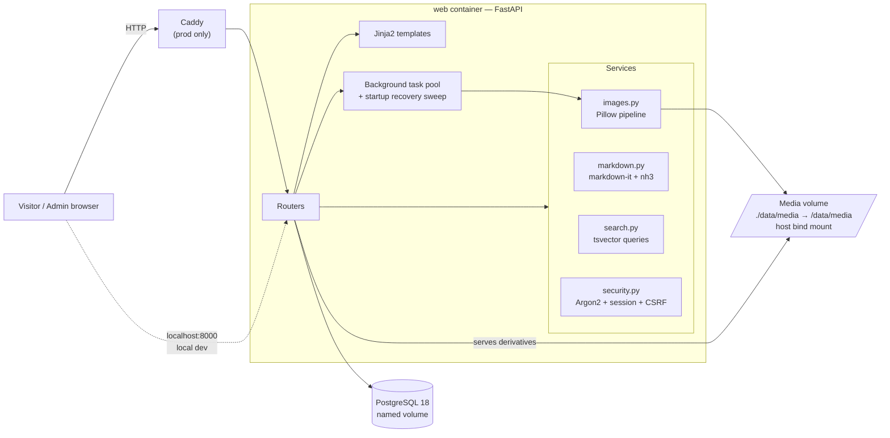

# Technical Plan

Inputs: `docs/BRIEF.md`, `docs/SPEC.md`. Date: 2026-08-04.

## Recap — goals & constraints

Build a Russian-language personal site with four sections (Главная / Разработка / Фото / Блог) where the owner edits content **in place on the public pages** after logging in. Python backend, everything in Docker, photo storage bind-mounted to the host disk, local-first delivery. Polished but deliberately not over-engineered: no 3D, no WebGL, no tags/reading time/counters, no external integrations at all.

Hard constraints driving the design:

- Single admin, no registration → authentication can stay simple and boring.
- Up to ~1500 photos / ~20 GB of originals → real image pipeline, background processing.
- Site-wide search over three content types → must not require an external search engine.
- The owner is a Python backend developer → the codebase must be one he can maintain.
- Adding English later must be additive, not a rewrite.

## Recommended stack

**FastAPI + Jinja2 server-rendered pages + htmx, PostgreSQL, hand-written CSS. One application container, no Node build step.**

| Layer | Choice | Version (verified Aug 2026) |
|-------|--------|------------------|
| Language | Python | 3.13 |
| Web framework | FastAPI | 0.141.x |
| Templating | Jinja2 (server-rendered HTML) | 3.x |
| Interactivity | htmx + small vanilla JS modules + SortableJS | htmx 2.0.x, SortableJS 1.15.x |
| ORM / migrations | SQLAlchemy 2.0 (stable) + Alembic | SA 2.0.x, Alembic 1.18.x |
| Database | PostgreSQL (also provides full-text search) | 18.4 |
| Images | Pillow | 12.3.0 |
| Markdown | markdown-it-py + mdit-py-plugins, sanitised with nh3 | nh3 0.3.5 |
| Passwords | argon2-cffi (Argon2id) | current |
| Server | Uvicorn, single worker | current |
| Packaging | uv + `pyproject.toml` + lockfile | current |
| Lint/format | Ruff | current |
| Tests | pytest + httpx ASGI transport; Playwright (Python) for e2e | current |
| Reverse proxy (prod only) | Caddy, automatic HTTPS | 2.x |

### Why this stack — five bullets

1. **It is one deployable unit.** One Python image plus Postgres. No separate frontend service, no Node toolchain, no build artefacts to keep in sync — which is exactly the "против переусложнения" constraint applied to operations, not just features.
2. **Server-rendered HTML is the right default for this product.** The primary user is a prospective client arriving from a link; SSR gives fast first paint, working SEO and Open Graph previews for free. An SPA would add a build pipeline and hurt both.
3. **htmx makes inline editing natural.** Editing in place means swapping a rendered block for an editable one and back. That is htmx's core case — the same Jinja partial serves the public view, the edit form and the live Markdown preview, so preview and published output cannot diverge.
4. **Postgres removes a whole component.** `tsvector` with the Russian text-search configuration covers site-wide search across articles, projects and albums with a GIN index and no Elasticsearch/Meilisearch container to run and back up.
5. **It matches the owner's stack.** FastAPI, SQLAlchemy, Alembic, pytest and Docker Compose are what his repositories already use, and FastAPI is his stated 2026 direction — he can maintain and extend this without learning a new ecosystem.

### Alternatives considered

| Option | Why not |
|--------|---------|
| **Django + django-admin** | The batteries (auth, ORM, admin) are excellent, but the brief explicitly rejects "go to a separate admin panel and edit things there" as the editing model. Building inline editing on top of Django and then ignoring its admin discards most of the advantage. Kept as a viable fallback if inline editing proves harder than expected. |
| **Next.js frontend + FastAPI backend** | Best polish ceiling, but two services, a Node build, and a frontend the owner does not maintain professionally. Contradicts both the simplicity constraint and the "easy to live with afterwards" requirement. |
| **Static site generator (Astro/Hugo) + Git-based CMS** | Would be fast and cheap, but content editing becomes a build-and-deploy cycle. Incompatible with "I log in and upload 40 photos". |
| **SQLite instead of Postgres** | Fewer moving parts and trivially backed up, but Russian full-text search would need FTS5 with custom tokenisation, and the owner deploys Postgres professionally. The cost is one extra compose service. |
| **Tailwind CSS** | Fast to build with, but requires a Node build stage in the Dockerfile. Hand-written CSS with custom properties gives full control over a deliberately distinctive design and keeps the image Python-only. |
| **Celery/Redis worker for image processing** | Correct at scale, wrong here — a third and fourth container for a personal site. In-process background tasks with a startup recovery sweep cover the actual load (one person uploading one album at a time). Recorded as the fallback if it proves insufficient. |

## Architecture



Request shapes:

- **Public page** → router → SQLAlchemy query → Jinja2 → full HTML.
- **Inline edit** → htmx request → router → same Jinja *partial* rendered in edit or view mode → swapped into the DOM.
- **Photo upload** → `uploader.js` posts each file via XHR (per-file progress) → router validates and stores the original → background task generates derivatives → htmx polls the album grid until every photo is `ready`.
- **Search** → one query per content type against `search_vector`, ranked, grouped in the template.

## Data / content model

Tables as specified in `SPEC.md` → `admin_user`, `album`, `photo`, `post`, `project`, `site_content`, `login_attempt`.

Implementation notes:

- **Full-text search**: each of `album`, `post`, `project` gets a `search_vector tsvector` column, `GENERATED ALWAYS AS` a weighted concatenation (`setweight(to_tsvector('russian', title), 'A')` + description/body at `'B'`), with a GIN index. Queries use `websearch_to_tsquery('russian', :q)` and `ts_rank`. Drafts and unpublished rows are filtered out for anonymous visitors at the query level.
- **`lang` columns** are present and default to `'ru'`. UI strings live in `app/i18n/ru.json` and are looked up through a template helper rather than hardcoded, so the English version is later a second JSON file plus a language filter on content queries — no schema change.
- **Media paths are stored relative** to the media root (`albums/{album_id}/{uuid}_1600.webp`), never absolute, so the volume can be relocated.
- **Photo status machine**: `pending → processing → ready | failed`. Only `ready` photos are shown to visitors; the admin also sees the others with their state.
- **`site_content`** is a small key/value table (`home.intro`, `home.contacts`, …) that makes the home page copy editable without a code change.
- One Alembic migration creates the entire schema in M2, before the feature modules start, so parallel work never produces conflicting migrations.

## Auth & security

- **Seeding**: on startup, if no `admin_user` exists, one is created from `ADMIN_USERNAME` / `ADMIN_PASSWORD`; the plaintext is never logged or stored. Startup fails loudly if those variables are missing.
- **Passwords**: Argon2id via `argon2-cffi`.
- **Sessions**: Starlette `SessionMiddleware` (signed cookie, `SECRET_KEY` from env), `HttpOnly`, `SameSite=Lax`, `Secure` when `ENV=production`, 30-day lifetime. The cookie carries a `session_token` that is also stored on `admin_user`; logout rotates it, which invalidates existing cookies server-side.
- **Authorisation**: every mutating route depends on `require_admin`. A test enumerates the application's routes and asserts that each non-`GET` route (excluding `/login`) rejects anonymous requests — so a new endpoint added later cannot silently ship unprotected.
- **CSRF**: a token stored in the session, injected into forms and into htmx requests via `hx-headers` on `<body>`, verified for every state-changing request.
- **Rate limiting**: `login_attempt` rows keyed by IP; 5 failures in 15 minutes → `429`. Responses do not distinguish unknown user from wrong password.
- **Uploads**: extension + declared MIME + magic-byte check, `Image.verify()` decode check, 25 MB cap, 50 files per batch, filenames generated server-side as UUIDs, target paths resolved and asserted to be inside the media root. Media is served through a route/static mount that sets `Content-Disposition: inline` and a fixed image content type, so nothing under the media volume can execute.
- **Markdown**: rendered with `markdown-it-py` (HTML disabled at the parser level) and then passed through `nh3` with an explicit tag/attribute allow-list.
- **Headers**: `X-Content-Type-Options: nosniff`, `Referrer-Policy: strict-origin-when-cross-origin`, `X-Frame-Options: DENY`, and a CSP of `default-src 'self'` — achievable because every font, stylesheet and script is self-hosted. The one inline script (pre-paint theme application) carries a per-request nonce.
- **Secrets**: `.env` git-ignored, `.env.example` committed with placeholder values and comments.

## Design direction (locked in M1, before feature work)

- **Themes**: `data-theme="light" | "dark"` on `<html>`, defaulting to `prefers-color-scheme`, applied by a tiny blocking inline script so there is no flash. Dark surfaces are dark grey (≈ `#17181A` background, `#212326` raised), never `#000`. Light surfaces are warm off-white (≈ `#FAF9F7`).
- **Colour**: near-neutral UI so photographs carry all the colour, with a single restrained accent used for links, focus rings and active navigation state. Every text/background pair is contrast-checked against WCAG 2.2 AA in both themes during M1 — the palette values above are starting points, not final tokens.
- **Typography**: self-hosted variable fonts with full Cyrillic coverage — **Onest** for headings and body (SIL OFL, modern neo-grotesque) with wide weight contrast and tightened tracking on large sizes, plus **JetBrains Mono** for small labels and code. Fluid type scale with `clamp()`. Article measure held at 65–75 characters.
- **Navigation**: a rounded pill bar, horizontally centred, on a surface one step off the page background — section links, the search field and the theme toggle inside it. Collapses to a compact form under 768 px. Fixed on scroll with a subtle backdrop blur.
- **Cards**: generous whitespace, one image, one title, one line of supporting text. No tags, no reading time, no counters — enforced as a review item, since this is the specific thing the owner disliked in the reference.
- **Motion**: fade/slide-in on first paint, hover lifts, lightbox open/close. All under 250 ms, all disabled under `prefers-reduced-motion`. No scroll-driven or 3D effects.
- CSS is organised with `@layer reset, tokens, base, layout, components, utilities`; tokens live in one file and are the only place colours are defined.

## Repository map

```text
/
├── docker-compose.yml            # local: db + web
├── docker-compose.prod.yml       # override: caddy, no exposed db, Secure cookies
├── Caddyfile
├── Dockerfile
├── .env.example
├── .dockerignore / .gitignore
├── Makefile                      # up, down, migrate, seed, test, e2e, backup, lint
├── pyproject.toml / uv.lock
├── alembic.ini
├── data/                         # git-ignored, host disk
│   ├── media/{originals,derived}/ # bind-mounted into the container
│   └── backups/
├── app/
│   ├── main.py                   # app factory, middleware, router registration, startup hooks
│   ├── config.py                 # pydantic-settings
│   ├── db.py                     # engine, session dependency
│   ├── deps.py                   # require_admin, current_user, csrf
│   ├── security.py               # argon2, sessions, csrf, rate limiting
│   ├── background.py             # task pool + startup recovery sweep
│   ├── models/                   # album, photo, post, project, site_content, admin_user
│   ├── routers/
│   │   ├── pages.py              # /, error handlers, site_content editing
│   │   ├── auth.py               # /login, /logout
│   │   ├── photos.py             # /photo, /photo/{slug}, album & photo admin, uploads
│   │   ├── blog.py               # /blog, /blog/{slug}, editor, preview, publish
│   │   ├── projects.py           # /dev, /dev/{slug}, project admin
│   │   ├── search.py             # /search
│   │   └── seo.py                # sitemap.xml, robots.txt
│   ├── services/
│   │   ├── images.py             # validation, derivatives, deletion
│   │   ├── markdown.py           # render + sanitise
│   │   ├── search.py             # tsvector queries
│   │   └── slugs.py              # transliteration + uniqueness
│   ├── i18n/ru.json
│   ├── templates/
│   │   ├── base.html, partials/{nav,footer,admin_bar,card,empty_state}.html
│   │   ├── pages/{home,search,404,500}.html
│   │   ├── photo/, blog/, dev/
│   └── static/
│       ├── css/{tokens,base,layout,components,photo,blog,dev}.css
│       ├── js/{theme,lightbox,uploader,editor,sortable-init}.js + vendor/
│       └── fonts/
├── migrations/versions/
├── tests/{unit,api,conftest.py}
└── e2e/                          # Playwright
```

## Milestones

| # | Milestone | Content | Parallel? |
|---|-----------|---------|-----------|
| **M0** | Scaffold | Repo layout, `pyproject.toml`, Dockerfile, compose, Postgres, Alembic wiring, config, health check, Makefile, `.env.example` | serial |
| **M1** | Design system + public shell | Tokens, both themes, fonts, pill navigation, base layout, home page, error pages, empty-state component | serial — everything depends on the tokens |
| **M2** | Auth + schema + admin core | Full Alembic migration for every table, admin seeding, login/logout, sessions, CSRF, rate limiting, `require_admin`, admin bar, inline-edit pattern for `site_content`, router registration stubs | serial |
| **M3** | Photography module | Album CRUD, upload endpoint, Pillow pipeline, background processing + recovery, grid, lightbox, reorder, cover, alt text, publish | ∥ with M4, M5 |
| **M4** | Blog module | Markdown service, editor with live preview, in-editor image upload, draft/publish, index, article page | ∥ with M3, M5 |
| **M5** | Development module | Project card CRUD, ordering, publishing, list and detail pages | ∥ with M3, M4 |
| **M6** | Search + SEO | `tsvector` queries across all three types, grouped results page, sitemap, robots, meta/OG tags | after M3–M5 |
| **M7** | Harden | pytest suite incl. the authorisation sweep, Playwright flows, a11y and contrast pass, performance check on a 50-photo album, backup command, `HANDOFF.md` | after M6 |

**Parallel workstreams.** M3/M4/M5 are dispatched to three implementer subagents at once. They are safe to parallelise because the schema, migration, shared partials and router registration all land in M2, so each agent owns a disjoint set of files:

| Agent | Owns | Must not touch |
|-------|------|----------------|
| photo | `app/routers/photos.py`, `app/services/images.py`, `app/templates/photo/**`, `app/static/js/{lightbox,uploader}.js`, `app/static/css/photo.css`, `tests/**/test_photo*` | `main.py`, `models/**`, `migrations/**`, `tokens.css`, shared partials |
| blog | `app/routers/blog.py`, `app/services/markdown.py`, `app/templates/blog/**`, `app/static/js/editor.js`, `app/static/css/blog.css`, `tests/**/test_blog*` | same |
| dev | `app/routers/projects.py`, `app/templates/dev/**`, `app/static/css/dev.css`, `tests/**/test_project*` | same |

The parent agent owns everything shared, integrates the three branches, and resolves any collision.

## Test strategy

- **Unit** — image pipeline (derivative sizes, aspect ratio, EXIF orientation, rejection of bad files), Markdown rendering and sanitisation (`<script>`, `onerror`, `javascript:` URLs), slug generation and collision handling, search query construction.
- **API/integration** (pytest + httpx against the ASGI app, real Postgres test database) — public pages render; drafts and unpublished items 404 for anonymous visitors; login, logout, rate limiting; **the route sweep asserting every mutating endpoint rejects anonymous requests**; CSRF rejection; upload happy path and each rejection case.
- **E2E** (Playwright) — the six flows from the launch checklist: admin login; create album and upload a batch; publish an article written in Markdown; open, navigate and close the lightbox by keyboard; toggle the theme and confirm it survives a reload; search and land on a result.
- **Manual/assisted** — keyboard-only pass, contrast check in both themes, and a 50-photo album loaded to confirm grid performance and absence of layout shift.
- Fixtures generate small synthetic images; no large binaries in the repository.

## Local run / env

```bash
cp .env.example .env      # set SECRET_KEY, ADMIN_USERNAME, ADMIN_PASSWORD
make up                   # docker compose up --build
# → http://localhost:8000 , admin login at /login
make migrate              # alembic upgrade head (also run automatically on startup)
make test                 # pytest
make e2e                  # playwright
make backup               # pg_dump + media archive into ./data/backups
```

Environment variables: `ENV`, `SECRET_KEY`, `DATABASE_URL`, `ADMIN_USERNAME`, `ADMIN_PASSWORD`, `MEDIA_ROOT`, `SITE_URL`, `MAX_UPLOAD_MB`.

**Volumes.** `./data/media` is a **bind mount** to the host disk — this is the owner's explicit requirement, and it means `docker compose down -v` cannot destroy photographs. PostgreSQL uses a **named volume** instead, because bind-mounting a Postgres data directory on Docker Desktop for Windows is a known source of permission failures; durability for the database is provided by `make backup` writing dumps into `./data/backups`, which *is* on the host disk.

## Deploy notes (after local approval)

`docker compose -f docker-compose.yml -f docker-compose.prod.yml up -d` on the VPS. The prod override adds Caddy (automatic HTTPS for the owner's domain), stops publishing the database port, and sets `ENV=production` so session cookies become `Secure`. Server sizing: allow ~30 GB for media plus headroom. Full steps go into `docs/HANDOFF.md`.

## Risks

1. **Inline editing widens the authenticated surface.** Mitigated by the automated route sweep (a structural test, not a checklist item).
2. **Batch image processing in-process.** Sized for one person uploading one album; a worker container is the documented fallback. The app runs a single Uvicorn worker so background state and the recovery sweep stay coherent — scaling to multiple workers would require the queue.
3. **Windows host bind mounts.** Addressed by keeping only media on a bind mount; the media path is configurable via `MEDIA_ROOT`.
4. **Russian stemming quality in Postgres FTS.** Accepted for v1; adding an external engine would contradict the simplicity constraint.
5. **Design subjectivity.** M1 delivers the visual direction before any feature work, so correction is cheap.
6. **Font licensing.** Onest and JetBrains Mono are SIL OFL, self-hosting is permitted; the licence files ship in `app/static/fonts/`.

## Definition of Done

- Every requirement F1–F37 in `SPEC.md` implemented and demonstrable.
- `docker compose up` on a clean checkout serves the whole site after only copying `.env.example`; photos survive `down` + `up`.
- `pytest` green, including the authorisation sweep and upload pipeline; Playwright flows green.
- No console errors or failed requests on any page in either theme; keyboard-only pass completed; AA contrast verified in both themes.
- No tags, reading time, view counters, comments, RSS, contact form, analytics or third-party network requests anywhere in the delivered site.
- `docs/STATUS.md` reflects reality; `docs/HANDOFF.md` documents running, editing, backing up and deploying to the VPS.
